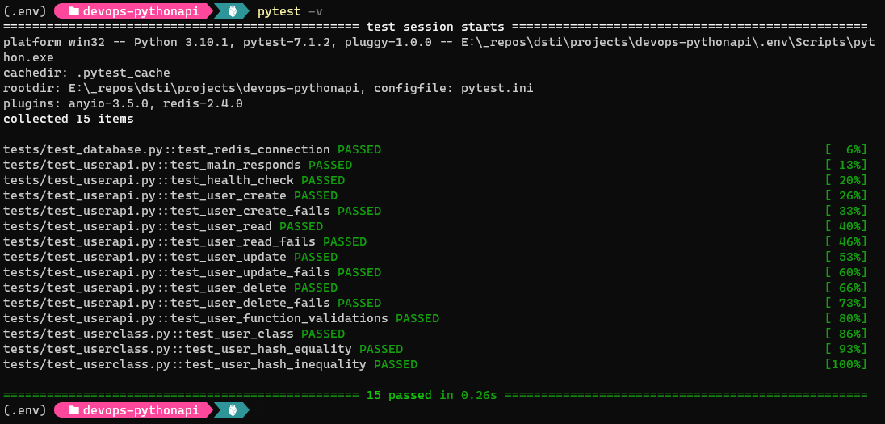
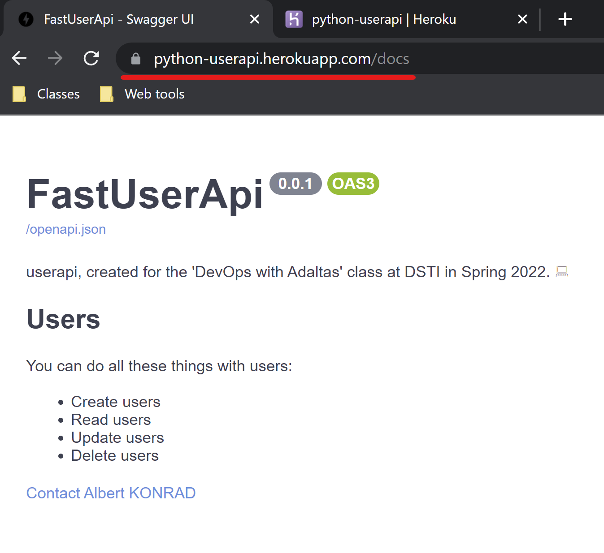
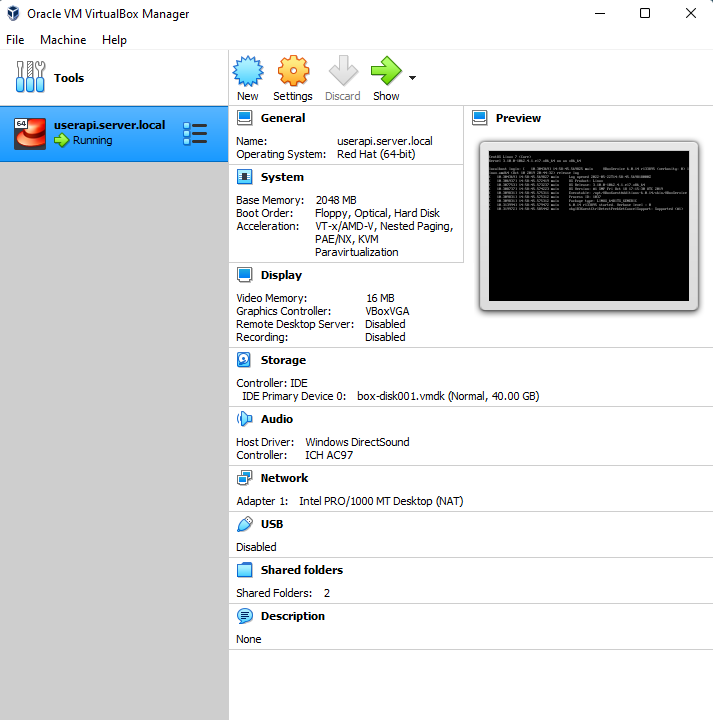
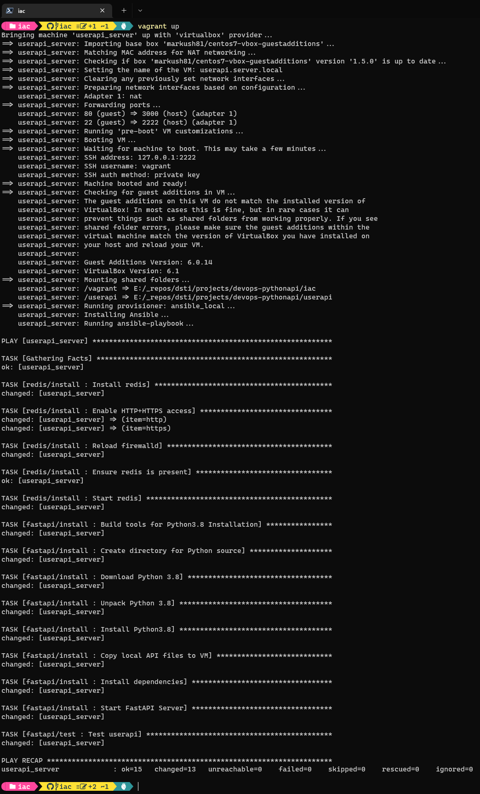
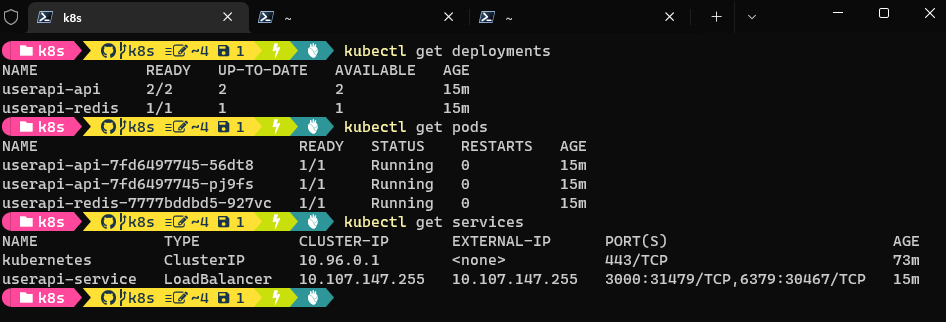
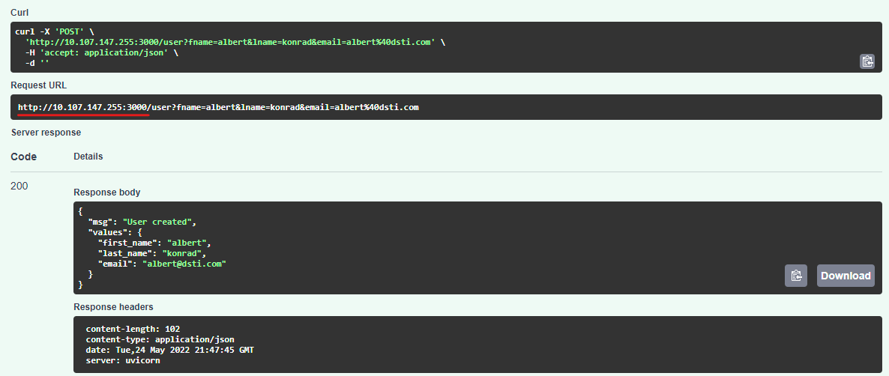
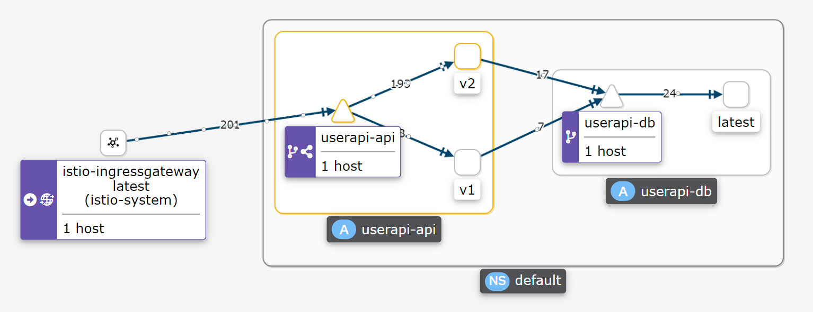

# DSTI DevOps with Adaltas, Spring 2022: Final Project 

This is the final assignment for the DevOps class taught at Data ScienceTech Institute in Paris in Spring 2022. 

The project contains a simple web API written in Python that is deployed using a variety of DevOps tools and processes.

## Installation
1. Clone this repository: ```git clone mralbertk/dsti-devops-final```
2. Install redis: [Installing Redis](https://redis.io/docs/getting-started/installation/)
3. Install Docker: [Get Docker](https://docs.docker.com/get-docker/)
4. [Install Python 3](https://www.python.org/downloads/) and dependencies:

```bash 
# Install dependencies
cd your/local/repository
python3 -m pip install -r requirements.txt
```

## Run

### On localhost
```bash
# Launch a local redis instance 
redis-server --daemonize yes

# Launch the API in local
cd .\src\api
uvicorn api:app
```

### Via Docker
```bash
# In repository root
docker-compose up 
```

## Alternative Deployments 
Additional installation, deployment and run instructions:

- [Vagrant](./iac/)
- [Kubernetes](./k8s/)


## Use
The API supports the following endpoints:

- `root`: Accepts `get` method.
- `/health`: Accepts `get` method.
- `/user`: Accepts `get`, `post`, `update` and `delete` methods.

Full documentation is available at `/docs`. _(Note: FastAPI supports Swagger by default.)_

## Report 

### Task 1: Create a Web Application
- Re-built the example `userapi` in Python using FastAPI
- Using a redis db instance

### Task 2: Apply CI/CD Pipeline
- Unit & Integration tests implemented with [pytest](https://docs.pytest.org/en/7.1.x/) in `./tests` 
- Run locally from root directory with `pytest -v` 
- _Note: Dependencies must be installed & redis-server must be running for tests to work_



- Continuous deployment to Heroku configured: [python-userapi.herokuapp.com](https://python-userapi.herokuapp.com/)
- Deployed as Docker container via workflow: [heroku-deploy.yml](/.github/workflows/heroku-deploy.yml)
- Note that the app is not fully functional on Heroku due to the absence of a working redis instance 



### Task 3: Infrastructure as Code with Vagrant & Ansible
- Configured a Centos/7 VM using Vagrant and Virtualbox



- Provisioned the box using Ansible local



### Task 4: Build Docker Image
- Available on [dockerhub](https://hub.docker.com/repository/docker/mralbertk/dsti-devops-fastapi)
- Using a multi-stage build

### Task 5: Container Orchestration with Docker Compose
- Configured two containers and a docker volume to persist redis data dump


### Task 6: Container Orchestration with Kubernetes 
- Configured with two deployments and one service
- First deployment: FastAPI frontend 
- Second deployment: redis backend (with persistent volume claim)
- Service: Configured as described [here on Stackoverflow](https://stackoverflow.com/a/50221754) to connect both 
deployments and link FastAPI to redis via DNS




_Note the IP in the request URL matches the `userapi-service` external ip_

### Task 7: Make a service mesh using Istio
- [Re-configured the original k8s deployment](istio/userapi-python.yml) to function well with Istio
  - Configured individual services for FastAPI and redis services
  - Configured two virtual services for each deployment
- Created a second version of the API and deployed both to the cluster
- Configured traffic routing: 25% to v1 and 75% to v2
- Also installed Prometheus and Kiali to access the dashboard




### Worthy Mentions

#### Web Application
I initially built a tasklist in NodeJS with a MongoDB backend based on [this tutorial](url) but switched to Python when 
I could not get the tests to work properly. Experimenting with NodeJS was interesting, but I am not familiar with the 
language and trying to learn it took too much time away from focussing on the real meat of this project, the DevOps 
workflows.

#### CI/CD 
With a Python implementation I found it much easier to set up the basic unit and integration testing workflows. That 
said, continuous delivery took me quite a while because the 
[Github/Heroku integration was unavailable from April 15 to May 25](https://status.heroku.com/incidents/2413). I 
considered alternative deployments (for example via AWS App Runner) but since I've already done a more complex AWS 
deployment in [another DSTI project](https://github.com/mralbertk/coral-detector/tree/main/deployments/aws), I decided 
to give Heroku another try.

Unfortunately, I couldn't get the direct deployment workflow we tested in class to function: No matter what command I 
tested in the procfile, the deployment failed with permission errors when executing the `uvicorn app:api` command. I
believe this was due to the structure of my app: The entire directory `userapi/` is deployed, but the run command needs
to be executed in `userapi/src/`. One option was to duplicate the `requirements.txt` file in the `src/` directory but
that wouldn't have been an elegant solution ... so I decided to deploy in a docker container instead.

This deployment required only one change to the existing code that does not affect any of the other deployments: I 
added `--port ${PORT:-8000}` to the docker run command, so it can pick up the dynamically assigned port on Heroku while
remaining unchanged in all other environments (at least those that do not have `$PORT` set ...).

#### Vagrant & Ansible
It was unexpectedly difficult to find a version of Centos/7 that could run with _sync folders_ on a Windows file
system. I ended up using a custom box uploaded by a community member that had the required guest tools installed.

Still, Centos/7 was not the best choice: My application uses FastAPI which requires Python 3.7, yet Centos/7 comes with
Python 3.6.x. I opted to use Python 3.8 as the latest "fully developed" version  Python, and installing it on the box
was an interesting experience. That said, in the future I'd rather look for an OS that supports the version of Python 
I need out of the box.

#### Kubernetes 
I believe it would have been much easier to work with one single deployment that includes the FastAPI container and
the redis container. However, I really wanted to build the solution with separate deployments for the app and the DB 
that can scale individually.

One error I made early one was to only connect the FastAPI pod to the service, assuming that pods from both deployments
would be able to network on the cluster. When it didn't work, I couldn't really figure out what was wrong. 

But  fortunately, a good friend of mine is the Lead SRE for World of Warcraft ... I asked him for troubleshooting tips, 
and he pointed out that both pods needed to be connected to a service in order to communicate. From there, I found the 
[post on Stackoverflow](https://stackoverflow.com/a/50221754) that helped me solve the problem.

#### Istio
My initial deployment with Istio was done fairly quickly; I simply installed it in addition to the existing K8s 
deployment, injected the sidecar proxies  and configured the ingress gateway plus one virtual service that routed all 
traffic to the existing load balancer. 

However, I did not think that this was a particular satisfying solution. After all, instead of deploying a proper 
service mesh I had only added some sidecar pods but the internal was managed by the load balancer, not via the envoys.

So I spent a while studying the bookinfo example from the Istio quick start guide and re-configured my deployment to 
have a proper service mesh.

## Author
**Albert KONRAD**  
Student, Applied MSc in Data Engineering for AI  
albert.konrad@edu.dsti.institute  

## Instructor
**Sergei KUDINOV**  
Big Data Engineer  
sergei@adaltas.com 