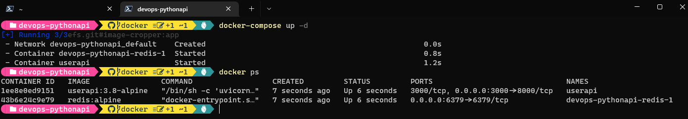

# DSTI DevOps with Adaltas, Spring 2022: Final Project 

This is the final assignment for the DevOps class taught at Data ScienceTech Institute in Paris in Spring 2022. 

The project contains a simple web API written in Python that is deployed using a variety of DevOps tools and processes.

## Installation
1. Clone this repository: ```git clone mralbertk/dsti-devops-final```
2. Install redis: [Installing Redis](https://redis.io/docs/getting-started/installation/)
3. Install Docker: [Get Docker](https://docs.docker.com/get-docker/)
4. [Install Python 3](https://www.python.org/downloads/) and dependencies:

```bash 
# Install dependencies
cd your/local/repository
python3 -m pip install -r requirements.txt
```

## Run

### On localhost
```bash
# Launch a local redis instance 
redis-server --daemonize yes

# Launch the API in local
cd .\src\api
uvicorn api:app
```

### Via Docker
```bash
# In repository root
docker-compose up 
```

## Alternative Deployments 
Additional installation, deployment and run instructions:

- [Vagrant](./iac/)
- [Kubernetes](./k8s/)
- [Kubernetes with Isito](./istio)


## Use
The API supports the following endpoints:

- `root`: Accepts `get` method.
- `/health`: Accepts `get` method.
- `/user`: Accepts `get`, `post`, `update` and `delete` methods.

Full documentation is available at `/docs`. _(Note: FastAPI supports Swagger by default.)_

## Report 

### Task 1: Create a Web Application
- Re-built the example `userapi` in [Python using FastAPI](./userapi)
- Using a redis db instance

### Task 2: Apply CI/CD Pipeline
- Unit & Integration tests implemented with [pytest](https://docs.pytest.org/en/7.1.x/) in `./tests` 
- Run locally from root directory with `pytest -v`
  - _Note: Dependencies must be installed & redis-server must be running for local tests to work_
- Also implemented as [Github action](./.github/workflows/api-testing.yml)


- Continuous deployment to Heroku configured: [python-userapi.herokuapp.com](https://python-userapi.herokuapp.com/)
- Deployed as Docker container via workflow: [heroku-deploy.yml](/.github/workflows/heroku-deploy.yml)
- _Note: The app is not fully functional on Heroku due to the absence of a working redis instance_


### Task 3: Infrastructure as Code with Vagrant & Ansible
- [Configured](./iac) a Centos/7 VM using Vagrant and Virtualbox


- [Provisioned](./iac/playbooks) the box using Ansible local


### Task 4: Build Docker Image
- Available on [dockerhub](https://hub.docker.com/repository/docker/mralbertk/dsti-devops-fastapi)
- Configured as multi-stage build: [Dockerfile](./userapi/Dockerfile)

### Task 5: Container Orchestration with Docker Compose
- Configured two services and a docker volume to persist redis data dump: [docker-compose.yml](./docker-compose.yml)



### Task 6: Container Orchestration with Kubernetes 
- Configured with two deployments and one service: [/k8s](./k8s)
- First deployment: FastAPI frontend 
- Second deployment: redis backend (with persistent volume claim)
- Service: Configured as described [here on Stackoverflow](https://stackoverflow.com/a/50221754) to connect both 
deployments and link FastAPI to redis via DNS


_Note the IP in the request URL matches the `userapi-service` external ip_

### Task 7: Make a service mesh using Istio
- [Re-configured the original k8s deployment](istio/userapi-python.yml) to function well with Istio
  - Configured individual services for FastAPI and redis services
  - Configured two virtual services for each deployment
- Created a second version of the API and deployed both to the cluster
- Configured traffic routing: 25% to v1 and 75% to v2
- Also installed Prometheus and Kiali to access the dashboard


### Task 8: Monitoring with Prometheus & Grafana 
- Not completed following issues with Minikube
- Deployed the [Prometheus & Grafana configurations](./istio/addons) that are supplied with Istio
- Started configuring a basic dashboard but then stopped when Windows kept terminating the Grafana connection

- Basic dashboard:


- Windows OS terminating Grafana:


 
### Conclusion
This was a very interesting project that taught me a lot. It might not all show here but the practice with Docker and
especially with Github actions enabled me to build a pipeline for a Serverless AWS pipeline in another project that I'm
very happy with: [coral-detector](https://github.com/mralbertk/coral-detector)

All things considered, I feel that I'm now "fluent" with Git, Github and Docker. For all the other tools we've seen, 
I'll need more time and practice to become really comfortable with them - especially Kubernetes - but I definitely had
enough hands-on time to be prepared to continue learning on my own, and I think that's all one can ask for in a brief 
university class.

Below are some more notes and reflections on my experiences that are not super-relevant to this report; they are for me 
so I can look back at this in a while and compare with how far I've come since today.

#### Web Application
I initially built a tasklist in NodeJS with a MongoDB backend based on [this tutorial](url) but switched to Python when 
I could not get the tests to work properly. Experimenting with NodeJS was interesting, but I am not familiar with the 
language and trying to learn it took too much time away from focussing on the real meat of this project, the DevOps 
workflows.

#### CI/CD 
With a Python implementation I found it much easier to set up the basic unit and integration testing workflows. That 
said, continuous delivery took me a while because the 
[Github/Heroku integration was unavailable from April 15 to May 25](https://status.heroku.com/incidents/2413). I 
considered alternative deployments (for example via AWS App Runner) but since I've already done a more complex AWS 
deployment in [another DSTI project](https://github.com/mralbertk/coral-detector/tree/main/deployments/aws), I decided 
to give Heroku another try. As you can see from the commit history, continuous deployment is one of the last parts I
implemented.

I opted to deploy the app in a docker container to Heroku instead of repeating the direct deployment  workflow we've 
done in class. After some research it turned out that I only needed to make one small change to the existing 
Dockerfile: Add `--port ${PORT:-8000}` to the RUN instruction in order to account for the dynamically set port in the 
Heroku environment.

#### Vagrant & Ansible
It was unexpectedly difficult to find a version of Centos/7 that could run with _sync folders_ on a Windows file
system. I ended up using a custom box uploaded by a community member that had the required guest tools installed.

Still, Centos/7 was not the best choice: My application uses FastAPI which requires Python 3.7, yet Centos/7 comes with
Python 3.6.x. I opted to use Python 3.8 as the latest "fully developed" version  Python, and installing it on the box
was an interesting experience. That said, in the future I'd rather look for an OS that supports the version of Python 
I need out of the box.

#### Kubernetes 
I believe it would have been much easier to work with one single deployment that includes the FastAPI container and
the redis container. However, I really wanted to build the solution with separate deployments for the app and the DB 
that can scale individually.

One error I made early one was to only connect the FastAPI pod to the service, assuming that pods from both deployments
would be able to network on the cluster. When it didn't work, I couldn't really figure out what was wrong. 

But  fortunately, a good friend of mine is the Lead SRE for World of Warcraft ... I asked him for troubleshooting tips, 
and he pointed out that both pods needed to be connected to a service in order to communicate. From there, I found the 
[post on Stackoverflow](https://stackoverflow.com/a/50221754) that helped me solve the problem.

#### Istio
My initial deployment with Istio was done fairly quickly; I simply installed it in addition to the existing K8s 
deployment, injected the sidecar proxies  and configured the ingress gateway plus one virtual service that routed all 
traffic to the existing load balancer. 

However, I did not think that this was a particular satisfying solution. After all, instead of deploying a proper 
service mesh I had only added some sidecar pods but the internal was managed by the load balancer, not via the envoys.

So I spent a while studying the bookinfo example from the Istio quick start guide and re-configured my deployment to 
have a proper service mesh.

#### Monitoring
This is the one part of the project that I could not finish. There are two main problems I ran into:

1. While I managed to add Prometheus and Grafana to my cluster, I do not understand how I need to configure Prometheus
so that it can contact my application's health check endpoint. I did some research into exposing Prometheus metrics 
from FastAPI (for example via this [instrumentator](https://github.com/trallnag/prometheus-fastapi-instrumentator)) but
did not pursue it further due to the other issues I had while working with Minikube.
  
2. When I deployed just the basic Prometheus & Grafana configurations to my cluster I ran into a series of issues that 
slowed me down to the point where I spent more time troubleshooting than continuing to work. The straw that broke the 
camel's back was when I noticed that Windows (or some other software on my system, the message is not very clear) 
regularly terminates some process required by Grafana (see screenshot above).

The ultimate learning from these issues is: When working with Minikube (and probably any other K8s cluster),
do not do it on Windows.

For the record, here are the main issues that plagued me during steps 6 to 8, all related to running Minikube on a 
Windows machine:

- `minikube start` behaves unpredictably on Windows
  - The maximum configuration I can launch on Desktop & Laptop is 4 CPU cores and 16384 MB of RAM
    - For reference, my desktop PC has 24 cores and 32gb of RAM, my laptop has 12 cores and 32 GB of RAM
    - Any higher configuration would cause the `minikube start` command to hang indefinitely
  - For no apparent reason, launching the `minikube` cluster with VirtualBox takes anytime between 5 and 25 minutes
  - In roughly 1/3 of the attempts, the cluster launch fails completely and needs to be re-started
  
  

- `minikube tunnel` became completely non-functional on my Desktop PC
  - Route conflicts prevent the Istio ingress gateway from receiving an external IP
  - Launching explicitly with `minikube tunnel --cleanup` does not resolve the conflicts
  - Unclear where the conflicting routes are coming from as ` ~/.minikube/tunnels.json` is empty 
  - Re-installing minikube did not solve the issue
  - Ultimately I had to continue working on my laptop where I can still run minikube


- Even when the cluster is running, Prometheus cannot be installed roughly 2 out of 3 attempts
  - Sometimes the cluster becomes partially or fully unresponsive when I apply the Prometheus configuration 
  - In other times the cluster continues to function but the Prometheus pod does not launch due to an image pull error

## Author
**Albert KONRAD**  
Student, Applied MSc in Data Engineering for AI  
albert.konrad@edu.dsti.institute  

## Instructor
**Sergei KUDINOV**  
Big Data Engineer  
sergei@adaltas.com 